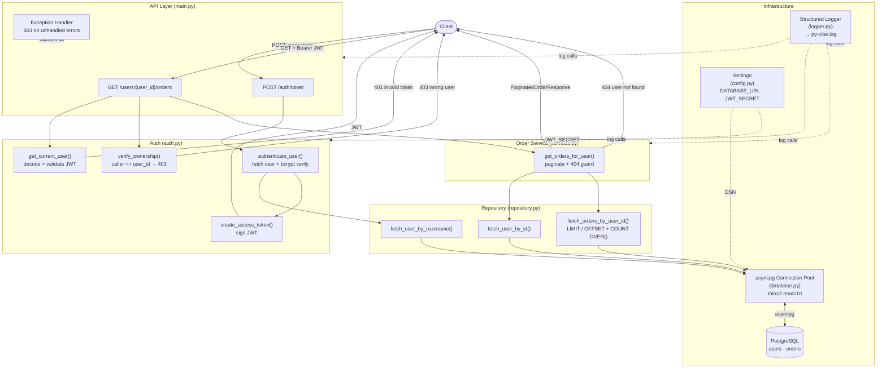

# PY-VIBE: Order History API

❗ This repository is a personal exercise of Vibe and Agent Coding. The project does not have any value. It is just a flow state, some LLM magic, and a vision that came together one prompt at a time. The code reflects a moment in time where the logic felt right, the prompts were hitting, and the aesthetic mattered as much as the execution.
* Logic Style: Intuitive and emergent.
* Dev Stack: Python + Pure Inspiration.
* Vibe Check: Passed.

## Features

A Python REST API built with **FastAPI** and **asyncpg** that lets authenticated users retrieve their own paginated order history from a PostgreSQL database.

- **JWT authentication** — issue tokens via `POST /auth/token`
- **Ownership enforcement** — users can only access their own orders (403 otherwise)
- **Paginated results** — 10 orders per page, sorted by `created_at DESC`
- **Async throughout** — asyncpg connection pool, fully non-blocking
- **Auto docs** — OpenAPI UI at `/docs`, ReDoc at `/redoc`

---

## Architecture



---

## Project Structure

```
py-vibe/
├── main.py              # API Layer — route handlers, app lifecycle
├── auth.py              # Auth Middleware, Authorization Guard, Token Service helpers
├── services.py          # Order Service — business logic + pagination
├── repository.py        # Database Layer — all parameterized SQL queries
├── database.py          # Connection Pool — asyncpg pool init/teardown
├── schemas.py           # Pydantic Schemas — request/response models
├── config.py            # Configuration — env vars via pydantic-settings
├── logger.py            # Structured logging setup
├── schema.sql           # PostgreSQL table definitions
├── seed.py              # Dev fixtures (alice + bob)
├── docker-compose.yml   # Local PostgreSQL via Docker
├── pyproject.toml       # Dependencies + tool config
└── .env.example
```

---

## Setup

### 1. Start the database

```bash
docker compose up -d
```

### 2. Install dependencies

```bash
uv sync
```

### 3. Configure environment

```bash
cp .env.example .env
# Edit .env with your DATABASE_URL and a strong JWT_SECRET
```

### 4. Seed dev data (optional)

```bash
python seed.py
# Creates: alice / password123  and  bob / password456
```

### 5. Run the server

```bash
uvicorn main:app --reload
```

---

## API Usage

### Obtain a token

```bash
curl -X POST http://localhost:8000/auth/token \
  -H "Content-Type: application/json" \
  -d '{"username": "alice", "password": "secret"}'
```

**Response:**
```json
{
  "access_token": "eyJ...",
  "token_type": "bearer"
}
```

---

### Fetch order history

```bash
curl http://localhost:8000/users/1/orders?page=1 \
  -H "Authorization: Bearer eyJ..."
```

**Response:**
```json
{
  "orders": [
    {
      "id": 99,
      "user_id": 1,
      "status": "delivered",
      "total_amount": "49.99",
      "created_at": "2024-03-15T10:30:00Z",
      "items": [{"product_id": 7, "name": "Widget", "qty": 1, "unit_price": "49.99"}]
    }
  ],
  "page": 1,
  "page_size": 10,
  "total": 1,
  "total_pages": 1
}
```

---

## HTTP Status Codes

| Code | Meaning |
|------|---------|
| 200  | Success |
| 401  | Missing, expired, or invalid JWT |
| 403  | Authenticated but accessing another user's orders |
| 404  | User not found |
| 422  | Invalid `user_id` or `page` parameter |
| 503  | Database or server error |

---

## Storing Passwords

To create a bcrypt hash for a user's password (for seeding the DB):

```python
import bcrypt
hashed = bcrypt.hashpw(b"secret", bcrypt.gensalt()).decode("utf-8")
print(hashed)
```