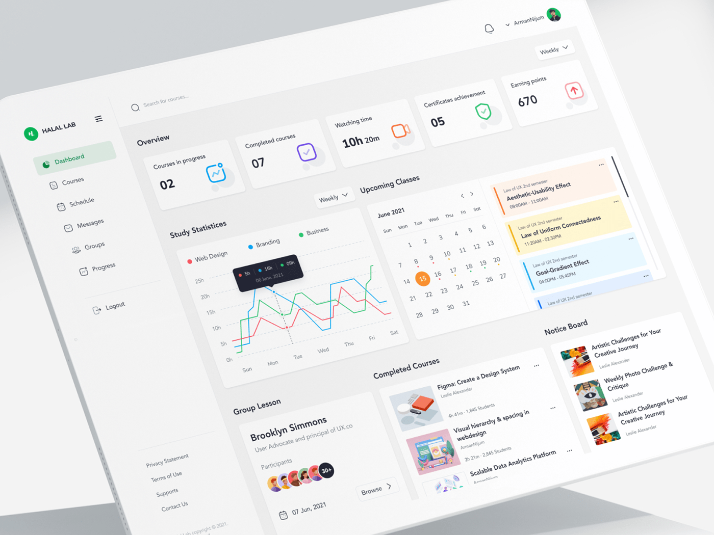

# VibeDrive UI Design Blueprint

VibeDrive is based on a soft-minimalist web design approach. This mean th web design is a **clean, calm, and modern visual style** that reduces cognitive load and keeps the user focused on what matters. It’s especially effective for learning platforms because it creates a sense of clarity and mental space.

---

## What soft‑minimalism looks like

---

## Core principles

### 1. **Whitespace‑first layout**
Whitespace isn’t “empty”—it’s a deliberate design tool.
It gives breathing room around content, reduces visual noise, and guides the eye naturally.

- Wide margins and generous padding
- Fewer elements per screen
- Clear separation between sections

---

### 2. **Neutral, low‑contrast color palettes**
Soft‑minimalism avoids harsh contrasts and instead uses gentle tones.

- Warm grays, off‑whites, muted blues, soft greens
- One accent color for highlights or CTAs
- Backgrounds that feel light and airy

This creates a calm environment ideal for long reading or learning sessions.

---

### 3. **Simple, readable typography**
Typography carries the personality of the interface.

- Sans‑serif fonts like Inter, Manrope, SF Pro, or IBM Plex
- Larger line height for readability
- Clear hierarchy using weight, not decoration

The result is a UI that feels modern without trying too hard.

---

### 4. **Subtle depth and micro‑interactions**
Soft‑minimalism isn’t flat—it uses *just enough* depth.

- Soft shadows
- Slight card elevation
- Smooth hover transitions
- Gentle animations (100–200ms)

These cues make the interface feel alive without overwhelming the user.

---

### 5. **Purpose‑driven components**
Every element must earn its place.

- Clean cards
- Simple buttons
- Uncluttered navigation
- Icons used sparingly

This keeps the interface intuitive and predictable.

---

## Why soft‑minimalism works well for learning apps
- Reduces cognitive load so users can focus on content
- Creates a sense of calm and trust
- Works beautifully with responsive layouts
- Ages well—minimalist designs stay modern longer
- Easy to scale into a full design system

---

Great — here is a **complete, production‑ready soft‑minimalist design system** tailored for a learning web app. It includes colors, typography, spacing, components, and interaction rules. Everything is structured so you can hand it directly to designers or implement it in code.

---

# Soft‑Minimalist Design System Specification
*(for a modern learning web app)*

## 1. **Foundations**

### 🎨 **Color System**
A calm, low‑contrast palette with one accent color for CTAs.

**Base palette**
- **Neutral‑0** — #FFFFFF (background)
- **Neutral‑50** — #F7F7F8 (secondary background)
- **Neutral‑200** — #E5E7EB (borders, dividers)
- **Neutral‑700** — #374151 (primary text)
- **Neutral‑900** — #111827 (headings)

**Accent palette**
- **Accent‑Primary** — #3B82F6 (blue)
- **Accent‑Primary‑Soft** — #E0EDFF (soft hover/selection)
- **Accent‑Success** — #10B981
- **Accent‑Warning** — #F59E0B
- **Accent‑Error** — #EF4444

**Usage rules**
- Backgrounds stay light and airy
- Text uses dark neutrals, not pure black
- Accent color appears in <10% of the UI to maintain calmness

---

### ✍️ **Typography**
Readable, modern, and unobtrusive.

**Primary font:** Inter
**Fallbacks:** system‑ui, Helvetica, Arial

**Scale**
- **H1** — 32px / 1.2
- **H2** — 24px / 1.3
- **H3** — 20px / 1.4
- **Body‑L** — 18px / 1.6
- **Body‑M** — 16px / 1.6
- **Body‑S** — 14px / 1.6

**Rules**
- Use weight (500–700) for hierarchy, not color
- Keep line height generous for readability
- Avoid decorative fonts entirely

---

### 📐 **Spacing System**
A simple 4‑point scale.

- 4 / 8 / 12 / 16 / 24 / 32 / 48 / 64

**Rules**
- Use 24–32px padding for cards
- Use 48–64px vertical spacing between major sections
- Keep layouts airy and uncluttered

---

## 2. **Components**

### 🧩 **Cards**
- Background: Neutral‑0
- Border: 1px Neutral‑200
- Radius: 12px
- Shadow: subtle (0 2px 6px rgba(0,0,0,0.04))
- Padding: 24–32px

**Use cases:** lessons, modules, progress summaries, quizzes

---

### 🔘 **Buttons**
**Primary button**
- Background: Accent‑Primary
- Text: white
- Radius: 8px
- Hover: slightly darker blue
- Animation: 120ms ease

**Secondary button**
- Border: 1px Neutral‑200
- Background: Neutral‑0
- Text: Neutral‑700

**Tertiary button**
- Text‑only
- Minimal hover underline

---

### 🧭 **Navigation**
- Sticky top bar with subtle border and minimal shadow
- **Layout:** Logo on left, navigation actions on right
- **For unauthenticated users:** Logo (left) | Login | Register (right, separated by pipe)
- **For authenticated users:** Logo (left) | Dashboard | Logout (right, separated by pipe)
- Max 5 primary nav items
- Use icons sparingly (only on logo)
- Smooth hover transitions on links (color: gray-700 → blue-500)
- Separator: light gray pipe (|) between nav items on right

**Mobile**
- Responsive: Stack navigation items on small viewports
- Clear labels, no mystery‑meat icons
- Maintain same left/right positioning logic

---

### 📚 **Learning Content Layout**
Optimized for focus and comprehension.

**Lesson page**
- Wide left margin
- Centered content column (max‑width: 720px)
- Progress indicator at top
- Sticky “Next lesson” CTA at bottom

**Exercise/quiz**
- Card‑based questions
- Large tap targets
- Minimal distractions

---

## 3. **Interactions & Motion**

### ✨ **Micro‑interactions**
Soft, subtle, and purposeful.

- Hover: 2–4% brightness shift
- Buttons: 120–160ms transitions
- Cards: slight elevation on hover
- Page transitions: fade or slide‑up (150–200ms)

Avoid:
- Bouncy animations
- Excessive movement
- High‑contrast flashes

---

## 4. **Iconography**

### 🖼️ **Icon Style**
- Thin line icons (1.5–2px stroke)
- Rounded corners
- Consistent stroke width
- Use icons only when they add clarity

---

## 5. **Example Screens**

### Example pages you can build with this system
- Dashboard with progress cards
- Course catalog with soft cards
- Lesson reader with centered content
- Quiz interface with clean question cards
- Profile & settings pages with simple forms

---
